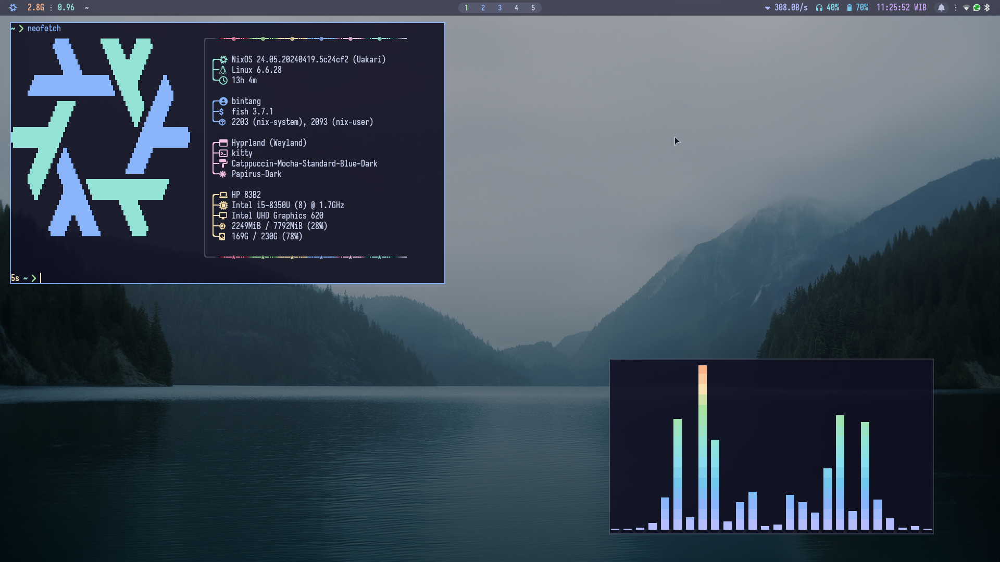

<h1 align="center">spitulax's NixOS Config</h1>

This is my [NixOS](https://nixos.org/) configuration for my systems.
This uses [Nix Flakes](https://nixos.wiki/wiki/Flakes) and if you want to use this for yourself, feel free!
Make sure you understand what you are going to copy. I do not intend to make this config very portable out of the box, at least outside my personal devices.

## Screenshot

## Features

- Easily extendable
- Utilizes Nix Flake
- Hardware-specific configuration [(details)](./hosts).
- Configurations for programs that I use [(details)](#components).
- Secret management with [sops.nix](https://github.com/Mic92/sops-nix)

## Components

Here are some of the programs configured in this repo.

#### Desktop

- **Display Manager**: [SDDM][SDDM]
- **Window Manager (Wayland)**: [Hyprland][Hyprland]

#### CLI Tools

- **Terminal Emulator**: [Kitty][Kitty]
- **Terminal Multiplexer**: [Tmux][Tmux]
- **Shell**: [Fish][Fish]
- **Shell Prompt**: [Starship][Starship]
- **Resource Monitoring**: [Btop][Btop]

#### GUI Apps

- **Browser**: [Brave][Brave]
- **Screen Recording**: [OBS][OBS]
- **WhatsApp Client**: [ZapZap][ZapZap]
- **Password Manager**: [Bitwarden][Bitwarden]
- **File Manager**: [Dolphin][Dolphin]
- **Screenshot**: [Grim][Grim]
- **Media Player**: [Mpv][Mpv]
- **Painting**: [Krita][Krita]
- **Image Viewer**: [Nomacs][Nomacs]
- **PDF Viewer**: [Zathura][Zathura]

#### Development

- **Text Editor**: [Neovim][Neovim] [(details)](./users/bintang/nvim)
- **Game Engine**: [Godot Engine][Godot Engine]

#### Misc

- **Colorschemes**: [Catppuccin][Catppuccin]
- **Font**: [Iosevka][Iosevka] with [Nerd Fonts][Nerd Fonts]
- **File Syncing**: [Syncthing][Syncthing]
- **Key Remapper**: [Keymapper][Keymapper]
- **IPA (International Phonetic Alphabet) Compose Key Rules** (incomplete)

## To-Do

- [ ] Set up [impermanence](https://github.com/nix-community/impermanence)

[SDDM]: https://github.com/sddm/sddm
[Kitty]: https://github.com/kovidgoyal/kitty
[Fish]: https://github.com/fish-shell/fish-shell
[Starship]: https://github.com/starship/starship
[Btop]: https://github.com/aristocratos/btop
[Brave]: https://brave.com/
[OBS]: https://obsproject.com/
[ZapZap]: https://github.com/zapzap-linux/zapzap
[Bitwarden]: https://bitwarden.com/
[Neovim]: https://github.com/neovim/neovim
[Godot Engine]: https://github.com/godotengine/godot
[Catppuccin]: https://github.com/catppuccin/catppuccin
[Iosevka]: https://github.com/be5invis/Iosevka
[Nerd Fonts]: https://github.com/ryanoasis/nerd-fonts
[Syncthing]: https://github.com/syncthing/syncthing
[Keymapper]: https://github.com/houmain/keymapper
[Hyprland]: https://github.com/hyprwm/Hyprland
[Tmux]: https://github.com/tmux/tmux
[Dolphin]: https://apps.kde.org/dolphin
[Grim]: https://sr.ht/~emersion/grim
[Mpv]: https://mpv.io/
[Krita]: https://krita.org/
[Nomacs]: https://nomacs.org/
[Zathura]: https://git.pwmt.org/pwmt/zathura
