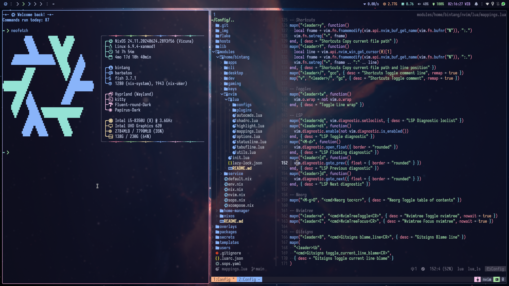

<h1 align="center">spitulax's NixOS Config</h1>

This is my [NixOS](https://nixos.org/) configuration for my systems with
[Nix Flake](https://nixos.wiki/wiki/Flakes). If you want to grab something from here, feel free!

## Screenshot

## Structure

This is my first attempt at centralizing NixOS configuration. This repo starts out humbly before
gradually turning into a mess. The current structure emerged slowly from me trying to refactor parts
of the config one at a time and from old structure that's stuck from the dawn of this repo, so there
was no planned structuring but I'm happy with this (for now).

- [`assets/`](./assets): Useless pictures
- [`flake/`](./flake): Stuff to be imported by [`flake.nix`](./flake.nix)
  - [`configs.nix`](./flake/configs.nix): Declaration of configs
  - [`vars.nix`](./flake/vars.nix): Variables that are shared with configs, modules, etc. so they
    are declared in flake
- [`hosts/`](./hosts): Host-specific configs
- [`lib/`](./lib): Helper functions (imported as `myLib` to flake)
- [`modules/`](./modules): See [here](./modules/README.md)
- [`overlays/`](./overlays): Nix overlays (imported to flake)
- [`packages/`](./packages): Nix packages and scripts I won't bother to move into separate repo
- [`secrets/`](./secrets): See [here](./secrets/README.md)
- [`templates/`](./templates): Template for projects that I can just pull into a blank directory
  with `nix flake init -t self#<name>` and it's just SO nice.
- [`users/`](./users): See [here](./users/README.md)
- [`flake.nix`](./flake.nix): The root of this entire repo
- [`default.nix`](./default.nix): Mostly there so I can use `lib/` from REPL
- [`Makefile`](./Makefile): Command shortener, e.g. `make nixos` for building NixOS configs,
  `make home` for building Home Manager configs, etc.

## REPL Tricks

Adding something to the flake's output means that it will be easily accessible from Nix REPL. The
idea is that the REPL is the best place to just quickly test the configs. So I've added some things
to the flake's output for easy access and also I've made so that if you load this flake in Nix REPL,
configurations declared in `./flake/configs.nix` are easily accessible by using `nixos-<hostname>`
for NixOS configs or `home-<username>-<hostname>` for Home Manager configs. This makes searching for
options and debugging much more convenient.

## Components

Here are some of the programs configured in this repo.

#### Desktop

- **Display Manager**: [GDM]
- **Window Manager (Wayland)**: [Hyprland]

#### CLI Tools

- **Terminal Emulator**: [Kitty]
- **Terminal Multiplexer**: [Tmux]
- **Shell**: [Fish] [(details)](./modules/home/bintang/cli/fish)
- **Shell Prompt**: [Starship]
- **Resource Monitoring**: [Btop]

#### GUI Apps

- **Browser**: [Brave]
- **Screen Recording**: [OBS]
- **Password Manager**: [Bitwarden]
- **File Manager**: [Dolphin]
- **Screenshot**: [Gripper]
- **Media Player**: [Mpv]
- **Painting**: [Krita]
- **Image Viewer**: [Nomacs]
- **PDF Viewer**: [Zathura]

#### Development

- **Text Editor**: [Neovim] [(details)](./modules/home/bintang/nvim)
- **Some toolings**: [(details)](./modules/home/bintang/dev)

#### Misc

- **Terminal Colorschemes**: [Catppuccin]
- **GTK Theme**: [Fluent GTK Theme]
- **Qt Theme**: [Materia KDE]
- **Font**: [Iosevka] with [Nerd Fonts]
- **File Syncing**: [Syncthing]
- **Key Remapper**: [Keymapper]
- **Secret Management**: [sops.nix]

#### And More!

## Cool Dotfiles

Dotfiles by other people that massively helped my Nix journey.

- <https://github.com/librephoenix/nixos-config>
- <https://github.com/jakehamilton/config>
- <https://github.com/Misterio77/nix-config>
- <https://github.com/ryan4yin/nix-config>
- <https://github.com/hlissner/dotfiles>
- <https://github.com/fufexan/dotfiles>

## To-Do

- [ ] Set up [impermanence](https://github.com/nix-community/impermanence)

[SDDM]: https://github.com/sddm/sddm
[Kitty]: https://github.com/kovidgoyal/kitty
[Fish]: https://github.com/fish-shell/fish-shell
[Starship]: https://github.com/starship/starship
[Btop]: https://github.com/aristocratos/btop
[Brave]: https://brave.com/
[OBS]: https://obsproject.com/
[Bitwarden]: https://bitwarden.com/
[Neovim]: https://github.com/neovim/neovim
[Godot Engine]: https://github.com/godotengine/godot
[Catppuccin]: https://github.com/catppuccin/catppuccin
[Iosevka]: https://github.com/be5invis/Iosevka
[Nerd Fonts]: https://github.com/ryanoasis/nerd-fonts
[Syncthing]: https://github.com/syncthing/syncthing
[Keymapper]: https://github.com/houmain/keymapper
[Hyprland]: https://github.com/hyprwm/Hyprland
[Tmux]: https://github.com/tmux/tmux
[Dolphin]: https://apps.kde.org/dolphin
[Gripper]: https://github.com/spitulax/gripper
[Mpv]: https://mpv.io/
[Krita]: https://krita.org/
[Nomacs]: https://nomacs.org/
[Zathura]: https://git.pwmt.org/pwmt/zathura
[GDM]: https://wiki.gnome.org/Projects/GDM
[Fluent GTK Theme]: https://github.com/vinceliuice/Fluent-gtk-theme
[Materia KDE]: https://github.com/PapirusDevelopmentTeam/materia-kde
[sops.nix]: https://github.com/Mic92/sops-nix
